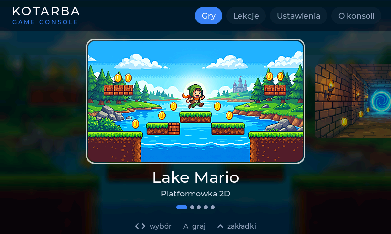
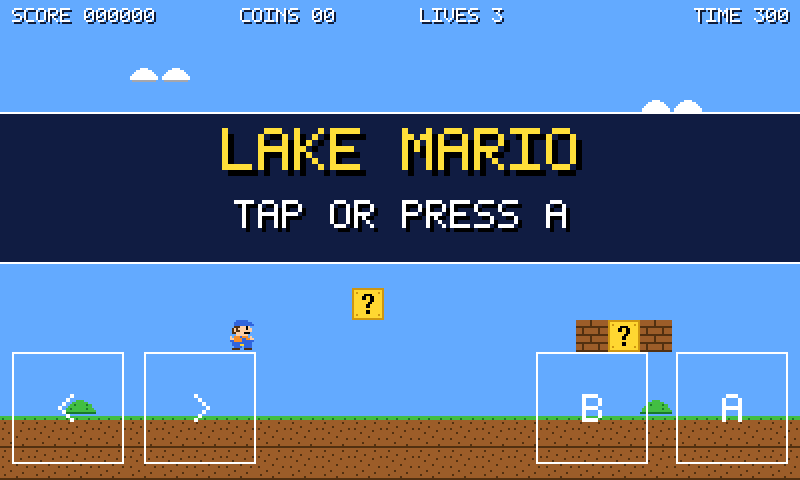
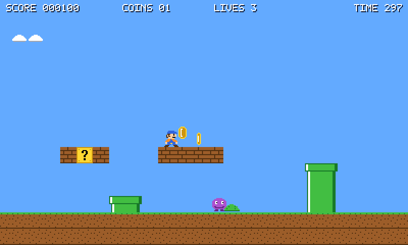
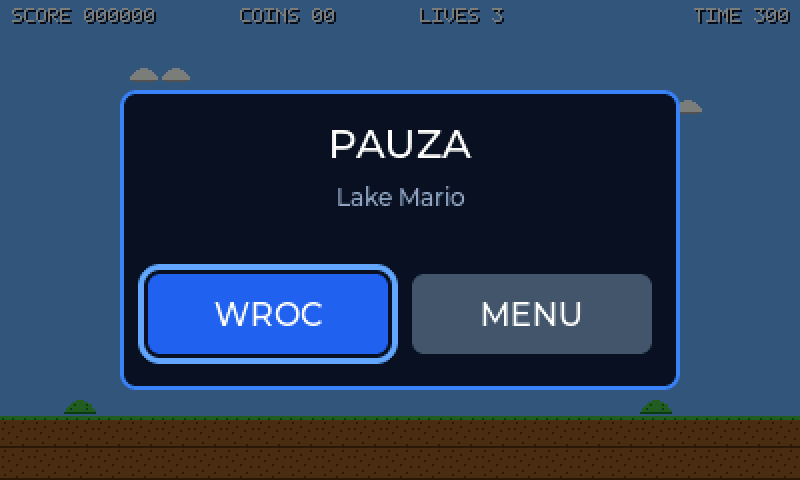

# LakeMarioGame

Mini konsola do gier na **ESP32-P4** (płytka Guition JC4880P443C, ekran 4,3" 480x800 z dotykiem).
UI konsoli w **LVGL 9**, gry na własnym rendererze 2D. Pierwsza gra: platformówka w stylu Super Mario.

W komplecie **emulator na Windows**, który uruchamia ten sam kod bez płytki.

| menu (LVGL) | ekran tytułowy | rozgrywka | pauza (LVGL na klatce gry) |
|---|---|---|---|
|  |  |  |  |

Zrzuty pochodzą z emulatora, wygenerowane poleceniem `lake_sim.exe --shot`.

## Framework: ESP-IDF 5.5 przez PlatformIO (pioarduino) + LVGL 9.5

Dlaczego tak:

- **ESP-IDF** to jedyny framework z pełną obsługą peryferiów ESP32-P4, których ta konsola potrzebuje:
  MIPI-DSI, PPA (sprzętowe skalowanie i obrót), PSRAM HEX, ESP-Hosted (Wi-Fi przez C6).
  Arduino na P4 jest nakładką na ESP-IDF bez wygodnego dostępu do tych bloków.
- **PlatformIO** masz już zainstalowane. Oficjalna platforma `platformio/espressif32` nie wspiera P4,
  więc używamy forka **pioarduino** (`55.03.312` = ESP-IDF 5.5.5).
- **LVGL** obsługuje UI: menu konsoli, ekran pauzy, w przyszłości ustawienia i wyniki.
  Gry rysują własnym rendererem (kafelki, sprite'y) — LVGL jest za wolne na pełnoekranową animację
  60 FPS, ale idealne do interfejsu.

## Dwa cele, jeden kod

```
                 wspolny kod: app/ engine/ gfx/ input/ ui/ games/
                            /                              \
   platform_esp.cpp (plytka)                                platform_win32.cpp (emulator)
   MIPI-DSI + PPA + GT911                                   okno Win32 + mysz + klawiatura
```

Cała logika, wygląd i UI są identyczne. Różni je tylko [warstwa platformy](src/platform/platform.h)
— około 150 linii po każdej stronie.

## Budowanie firmware

```bash
pio run --target upload --target monitor
```

Pierwszy build pobiera platformę, toolchain RISC-V i ESP-IDF (~1,5 GB), potem trwa kilkadziesiąt sekund.
Port: płytka zgłasza się jako "Urządzenie szeregowe USB". Jeśli PlatformIO nie trafi automatycznie,
odkomentuj `upload_port` w `platformio.ini`. Jeśli flashowanie nie wchodzi: przytrzymaj BOOT,
krótko RESET, puść BOOT.

## Budowanie emulatora

```bash
cmake -S sim -B sim/build -G Ninja -DCMAKE_C_COMPILER=C:/msys64/mingw64/bin/gcc.exe -DCMAKE_CXX_COMPILER=C:/msys64/mingw64/bin/g++.exe
```

```bash
cmake --build sim/build && ./sim/build/lake_sim.exe
```

Szczegóły, sterowanie, tryb zrzutów ekranu i testy skryptowane: [docs/EMULATOR.md](docs/EMULATOR.md).

## VS Code

Otwórz folder projektu. PlatformIO obsługuje firmware, CMake Tools obsługuje emulator, zadania są pod
`Ctrl+Shift+B` (`PIO:` i `SIM:`), debugowanie emulatora z paska CMake. Co zainstalować i na co
odpowiedzieć przy pierwszym otwarciu: [docs/VSCODE.md](docs/VSCODE.md).

## Sterowanie: krzyżak, gałka analogowa i przyciski

Kontroler w układzie zbliżonym do pada Switch: **mechaniczny krzyżak, jedna gałka analogowa
i pięć przycisków**, wszystko wprost na GPIO złącza JP1, bez matrycy i bez diod.

```
  [gałka]      [ UP ]                              [ X ]
            [LEFT][RIGHT]                      [ Y ]   [ A ]
               [DOWN]      [START]                 [ B ]
```

**A** to skok, **B** bieg i akcja, **START** pauza i zatwierdzanie w menu. **X** i **Y** czekają
na kolejne gry. Gałka dubluje krzyżak po progowaniu, a dodatkowo wystawia surowe osie dla gier
z płynnym ruchem. Układ, przypisanie pinów, kalibracja i powód braku SELECT:
[docs/HARDWARE.md](docs/HARDWARE.md).

Menu i pauza obsługują się klawiszami (GÓRA/DÓŁ + A) albo dotykiem. Ekran dotykowy zostaje jako
alternatywa: wirtualny pad na dole ekranu znika po pierwszym użyciu klawiatury.

W emulatorze każdy klawisz konsoli ma przypisany klawisz PC, konfigurowalny w
[sim/keymap.cfg](sim/keymap.cfg). Gałkę obsługuje pad USB podłączony do PC, a gdy go nie ma,
osobne klawisze.

## Struktura

```
platformio.ini         konfiguracja firmware (platforma pioarduino, ESP-IDF, flagi)
CMakeLists.txt         projekt ESP-IDF; dodaje src/ui (lv_conf.h) do sciezki wszystkich komponentow
sdkconfig.defaults     konfiguracja ESP-IDF pod te plytke (PSRAM, flash, rewizja P4, dotyk, LVGL)
partitions.csv         16 MB: 4 MB aplikacja + ~12 MB partycja `assets`
src/
  main.cpp             wejscie dla plytki: NVS -> platform::init -> task z app::run
  platform/            warstwa platformy: platform.h (interfejs) + platform_esp.cpp (plytka)
  board/               sterowniki plytki
    pins.h             wszystkie piny
    display.*          MIPI-DSI + ST7701, 2 bufory ramki, PPA, VSYNC
    touch.*            GT911
    keypad.*           przelaczniki mechaniczne (odklocanie 8 ms)
    joystick.*         galka analogowa na ADC2 (kalibracja, strefa martwa)
    buttons.*          przycisk BOOT (zapasowy START)
    st7701/            sterownik panelu od producenta (Apache-2.0)
  core/log.h           logowanie: ESP_LOGx na plytce, printf w emulatorze
  gfx/                 renderer 2D: Canvas (RGB565), Sprite (ASCII-art), czcionka 5x7
  input/               klawisze konsoli, PadState, wirtualny pad dotykowy
  engine/              interfejs Game, rozmiar plotna, licznik FPS, rejestr gier (id, find_game), rng
  ui/                  LVGL: lv_conf.h (WSPOLNY z emulatorem), spiecie z plotnem, menu, pauza
  app/                 petla konsoli: menu -> gra -> pauza -> menu
  lake/                proste API dla ucznia: lake.h (LAKE_GAME), lake_api.h, runtime, adapter SimpleGame
  games/mario/         gra: assety, poziom (ASCII), logika
  games/lekcje/        lekcje: lista.h + NN_nazwa/ (gra.cpp, README.md, testy.txt, rozwiazania/)
sim/                   emulator Windows: backend Win32, mapowanie klawiszy, pad USB, keymap.cfg
tests/                 scenariusze regresji Lake Mario (slady --trace i zrzuty) + wzorce
tools/                 testy.ps1 (regresja + testy lekcji), setup_kid_pc.ps1, fetch_lvgl.ps1, bmp2png.ps1
third_party/           (gitignore) LVGL pobrane przez fetch_lvgl.ps1 na komputerze bez PlatformIO
docs/HARDWARE.md       pinout, opis plytki, co zweryfikowac po przyjsciu sprzetu
docs/EMULATOR.md       emulator: budowanie, sterowanie, testy skryptowane
docs/VSCODE.md         konfiguracja VS Code: rozszerzenia, zadania, debug emulatora
docs/NAUKA.md          nauka C++: zalozenia, program lekcji, testy zadan, komputer ucznia (dla rodzica)
docs/DLA_UCZNIA.md     instrukcja dla ucznia: start, klawisze, sciagawka API, czytanie bledow
docs/DECYZJE.md        dziennik decyzji projektowych z uzasadnieniami
CLAUDE.md              kompletny przewodnik dla agenta AI: stan, komendy, pulapki, otwarte decyzje
```

## Nauka programowania: lekcje dla ucznia

Konsola jest też platformą do nauki C++ dla dziecka po Scratchu. Uczeń pisze dwie funkcje, `setup()` i `frame()`,
przez proste API [`lake`](src/lake/lake_api.h) (`rect`, `circle`, `held(LEFT)`, `random`, `watch`...), a menu, pauzę,
emulator i testy dostaje od konsoli. Lekcje leżą w [src/games/lekcje/](src/games/lekcje/): każda to katalog
z `gra.cpp`, `README.md` (jedna nowa koncepcja, zadania), `testy.txt` i rozwiązaniami. F6 w VS Code buduje
i uruchamia grę z otwartego pliku. Przewodnik dla rodzica: [docs/NAUKA.md](docs/NAUKA.md), instrukcja dla ucznia:
[docs/DLA_UCZNIA.md](docs/DLA_UCZNIA.md), instalacja na komputerze ucznia (bez PlatformIO): `tools/setup_kid_pc.ps1`.

## Dodawanie nowej gry

**Prosta gra (jak lekcja):** skopiuj `src/games/lekcje/00_szablon`, zmień `LAKE_GAME(id, "Nazwa", "opis")` na końcu
`gra.cpp`, dopisz `LEKCJA(id)` w [src/games/lekcje/lista.h](src/games/lekcje/lista.h). Emulator wykryje nowy plik sam.

**Gra na pełnym silniku (jak Lake Mario):**

1. Nowy katalog `src/games/<nazwa>/`, klasa dziedzicząca po `engine::Game` (`init`, `update`, `render`, `debug_line`).
2. Rysowanie na `gfx::Canvas` 800x480 (albo 400x240 powiększane x2 przez konsolę, gdy `canvas_scale()` zwraca 2 — pixel-art jak Lake Mario), wejście z `input::PadState`, losowość z `engine::rng()`, wygładzony tekst z `gfx/text.h`.
3. Wpis `{ "id", "Nazwa", "opis", fabryka }` w [src/games/registry.cpp](src/games/registry.cpp) — gra pojawi się w menu
   i pod `lake_sim.exe --game id`.
4. Firmware wylicza listę plików przy konfiguracji: po dodaniu plików `pio run --target clean`.

## UI w grze

Gry rysują HUD własnym rendererem, bo działa co klatkę i jest tani. Gdy potrzebne jest bogatsze UI
(menu, lista, klawiatura), użyj LVGL tak jak robi to ekran pauzy: zamroź klatkę gry do bufora,
podaj ją przez `ui::set_background_frame()` i zbuduj widgety na wierzchu. LVGL potrzebuje
nieprzezroczystego tła — rysowanie widgetów wprost na pikselach gry nie zadziała.

## Plan (roadmapa)

- [x] Platforma do nauki C++: API `lake`, 13 lekcji z testami, skrypt instalacyjny na komputer ucznia (`docs/NAUKA.md`)
- [ ] Próba generalna `tools/setup_kid_pc.ps1` na czystej maszynie, gałąź `lekcje`
- [ ] Uruchomienie na sprzęcie: ekran, dotyk, orientacja (patrz `docs/HARDWARE.md`)
- [ ] Dźwięk: ES8311 przez I2S (efekty + muzyka)
- [ ] Assety z partycji SPIFFS (narzędzie PNG -> RGB565)
- [ ] Ekran ustawień i zapis wyników w NVS
- [ ] Gamepad BLE przez ESP32-C6 (drugi gracz)

## Znane pułapki toolchaina (Windows + PlatformIO)

- **LVGL na ESP-IDF domyślnie ignoruje `lv_conf.h`** (`CONFIG_LV_CONF_SKIP=y`). Dlatego
  `sdkconfig.defaults` ustawia `CONFIG_LV_CONF_SKIP=n`, a `CMakeLists.txt` dokłada `src/ui`
  do ścieżki include wszystkich komponentów. Flagi z `platformio.ini` tam nie docierają.
- Plik `lv_conf.h` musi definiować strażnik o nazwie `LV_CONF_H` — po niej LVGL poznaje, że
  konfiguracja została wczytana.
- LVGL domyślnie dokłada do kompilacji swoje przykłady i dema (~258 plików). Wyłącza się je
  w `sdkconfig.defaults`, bo to opcje Kconfiga, nie `lv_conf.h`.
- Świeże `git init` **bez commita** wywala build: ESP-IDF woła `git describe` i nie znajduje HEAD.
- `espressif/esp_hosted` >= 3.0 nie kompiluje się pod PlatformIO na Windows — przy dodawaniu Wi-Fi
  przypnij `>=2.11,<3.0`.
- MinGW z MSYS2 wymaga `C:\msys64\mingw64\bin` w PATH, inaczej CMake zgłasza, że kompilator
  "nie jest w stanie skompilować prostego programu".
