# LakeMarioGame

Mini konsola do gier na **ESP32-P4** (płytka Guition JC4880P443C, ekran 4,3" 480x800 z dotykiem).
UI konsoli w **LVGL 9**, gry na własnym rendererze 2D. Pierwsza gra: platformówka w stylu Super Mario.

W komplecie **emulator na Windows**, który uruchamia ten sam kod bez płytki.

| menu (LVGL) | ekran tytułowy | rozgrywka | pauza (LVGL na klatce gry) |
|---|---|---|---|
|  |  |  |  |

Zrzuty pochodzą z emulatora, wygenerowane poleceniem `console_sim.exe --shot`.

## Framework: ESP-IDF 5.5 przez PlatformIO (pioarduino) + LVGL 9.5

Dlaczego tak:

- **ESP-IDF** to jedyny framework z pełną obsługą peryferiów ESP32-P4, których ta konsola potrzebuje:
  MIPI-DSI, PPA (sprzętowe skalowanie i obrót), PSRAM HEX, ESP-Hosted (Wi-Fi przez C6).
  Arduino na P4 jest nakładką na ESP-IDF bez wygodnego dostępu do tych bloków.
- **PlatformIO** masz już zainstalowane. Oficjalna platforma `platformio/espressif32` nie wspiera P4,
  więc używamy forka **pioarduino** (`55.03.312` = ESP-IDF 5.5.5).
- **LVGL** obsługuje UI: menu konsoli (karuzela okładek, lekcje, ustawienia, informacje), ekran pauzy.
  Gry rysują własnym rendererem (kafelki, sprite'y) — LVGL jest za wolne na pełnoekranową animację
  60 FPS, ale idealne do interfejsu.

## Dwa cele, jeden kod

```
                 wspolny kod: app/ engine/ gfx/ input/ ui/ games/
                            /                              \
   platform_esp.cpp (plytka)                                platform_win32.cpp (emulator)
   MIPI-DSI + PPA + GT911                                   okno Win32 + mysz + klawiatura
```

Cała logika, wygląd i UI są identyczne. Różni je tylko [warstwa platformy](src/platform/platform.h)
— około 150 linii po każdej stronie.

## Budowanie firmware

```bash
pio run --target upload --target monitor
```

Pierwszy build pobiera platformę, toolchain RISC-V i ESP-IDF (~1,5 GB), potem trwa kilkadziesiąt sekund.
Port: płytka zgłasza się jako "Urządzenie szeregowe USB". Jeśli PlatformIO nie trafi automatycznie,
odkomentuj `upload_port` w `platformio.ini`. Jeśli flashowanie nie wchodzi: przytrzymaj BOOT,
krótko RESET, puść BOOT.

## Budowanie emulatora

```bash
cmake -S sim -B sim/build -G Ninja -DCMAKE_C_COMPILER=C:/msys64/mingw64/bin/gcc.exe -DCMAKE_CXX_COMPILER=C:/msys64/mingw64/bin/g++.exe
```

```bash
cmake --build sim/build && ./sim/build/console_sim.exe
```

Szczegóły, sterowanie, tryb zrzutów ekranu i testy skryptowane: [docs/EMULATOR.md](docs/EMULATOR.md).

## VS Code

Otwórz folder projektu. PlatformIO obsługuje firmware, CMake Tools obsługuje emulator, zadania są pod
`Ctrl+Shift+B` (`PIO:` i `SIM:`), debugowanie emulatora z paska CMake. Co zainstalować i na co
odpowiedzieć przy pierwszym otwarciu: [docs/VSCODE.md](docs/VSCODE.md).

## Sterowanie: krzyżak, gałka analogowa i przyciski

Kontroler w układzie zbliżonym do pada Switch: **mechaniczny krzyżak, jedna gałka analogowa
i pięć przycisków**, wszystko wprost na GPIO złącza JP1, bez matrycy i bez diod.

```
  [gałka]      [ UP ]                              [ X ]
            [LEFT][RIGHT]                      [ Y ]   [ A ]
               [DOWN]      [START]                 [ B ]
```

**A** to skok, **B** bieg i akcja, **START** pauza i zatwierdzanie w menu. **X** i **Y** czekają
na kolejne gry. Gałka dubluje krzyżak po progowaniu, a dodatkowo wystawia surowe osie dla gier
z płynnym ruchem. Układ, przypisanie pinów, kalibracja i powód braku SELECT:
[docs/HARDWARE.md](docs/HARDWARE.md).

Menu i pauza obsługują się klawiszami (GÓRA/DÓŁ + A) albo dotykiem. Ekran dotykowy zostaje jako
alternatywa: wirtualny pad na dole ekranu znika po pierwszym użyciu klawiatury.

W emulatorze każdy klawisz konsoli ma przypisany klawisz PC, konfigurowalny w
[sim/keymap.cfg](sim/keymap.cfg). Gałkę obsługuje pad USB podłączony do PC, a gdy go nie ma,
osobne klawisze.

## Struktura

```
platformio.ini         konfiguracja firmware (platforma pioarduino, ESP-IDF, flagi)
CMakeLists.txt         projekt ESP-IDF; dodaje src/ui (lv_conf.h) do sciezki wszystkich komponentow
sdkconfig.defaults     konfiguracja ESP-IDF pod te plytke (PSRAM, flash, rewizja P4, dotyk, LVGL)
partitions.csv         16 MB: 4 MB aplikacja + ~12 MB partycja `assets`
src/
  main.cpp             wejscie dla plytki: NVS -> platform::init -> task z app::run
  platform/            warstwa platformy: platform.h (interfejs) + platform_esp.cpp (plytka)
  board/               sterowniki plytki
    pins.h             wszystkie piny
    display.*          MIPI-DSI + ST7701, 2 bufory ramki, PPA, VSYNC
    touch.*            GT911
    keypad.*           przelaczniki mechaniczne (odklocanie 8 ms)
    joystick.*         galka analogowa na ADC2 (kalibracja, strefa martwa)
    buttons.*          przycisk BOOT (zapasowy START)
    st7701/            sterownik panelu od producenta (Apache-2.0)
  core/log.h           logowanie: ESP_LOGx na plytce, printf w emulatorze
  gfx/                 renderer 2D: Canvas (RGB565), Sprite (ASCII-art), czcionka 5x7
  input/               klawisze konsoli, PadState, wirtualny pad dotykowy
  engine/              interfejs Game, rozmiar plotna, licznik FPS, rejestr gier (id, find_game), rng
  ui/                  LVGL: lv_conf.h (WSPOLNY z emulatorem), spiecie z plotnem, menu, pauza
  app/                 petla konsoli: menu -> gra -> pauza -> menu
  console/                proste API dla ucznia: console.h (CONSOLE_ADD_GAME), console_api.h, runtime, adapter SimpleGame
  games/mario/         gra: assety, poziom (ASCII), logika
  games/labirynt3d/    gra pokazowa: labirynt pseudo-3D (raycasting), tekstury PNG, mini-mapa
  games/kosmos/        gra pokazowa: strzelanka 2D w 800x480, sprite'y PNG, paralaksa, wybuchy
  games/kart/          wyscigi 3D (gfx3d, low-poly): tor z wzniesieniami, gokarty-modele, 3 rywali AI, przedmioty, drift
  games/snake/         waz: 10 poziomow w 5 swiatach, 9 przedmiotow, portal, tryb bez konca, grafika z Gemini (PNG z alfa)
  games/pacman/        labirynt: 4 plansze x 4 swiaty, 4 duchy z AI jak w oryginale, owoce, autopilot; grafika z Gemini
  games/invaders/      Space Invaders: formacja 5x10, nurkowania, UFO, bunkry kruszone pikselami, boss co 5 fal, bonusy; grafika z Gemini
  games/lekcje/        lekcje: lista.h + NN_nazwa/ (gra.cpp, README.md, testy.txt, rozwiazania/)
  gfx/lodepng/         dekoder PNG (lodepng, licencja zlib; tylko dekoder)
  gfx3d/               software'owy renderer 3D: math3d (Vec3/Mat4), mesh (siatki + bryly), renderer (rasteryzacja, swiatlo, mgla, sortowanie)
assets/                obrazki PNG gier w assets/<id gry>/; emulator czyta z dysku, plytka z partycji SPIFFS (pio run -t uploadfs)
sim/                   emulator Windows: backend Win32, mapowanie klawiszy, pad USB, keymap.cfg
tests/                 scenariusze regresji Lake Mario (slady --trace i zrzuty) + wzorce
tools/                 testy.ps1 (regresja + testy lekcji), setup_kid_pc.ps1, fetch_lvgl.ps1, bmp2png.ps1, gen_demo_assets.py, gen_kart_assets.py,
                       gen_snake_assets.py (surowe obrazy Gemini z assets_src/snake/ -> assets/snake/),
                       gen_pacman_assets.py (assets_src/pacman/ -> assets/pacman/), pacman_maze_check.py, pacman_maze_gen.py
assets_src/snake/      surowe obrazy z Gemini (arkusze obiektow na magencie, tla swiatow, ilustracja tytulowa) - nie ida na plytke
assets_src/invaders/   surowe obrazy z Gemini dla Space Invaders (2 arkusze sprite'ow, 4 tla, tytul) - nie ida na plytke
assets_src/pacman/     surowe obrazy z Gemini dla Pacmana (bohater, duchy, owoce, tla, tytul) - nie ida na plytke
third_party/           (gitignore) LVGL pobrane przez fetch_lvgl.ps1 na komputerze bez PlatformIO
docs/HARDWARE.md       pinout, opis plytki, co zweryfikowac po przyjsciu sprzetu
docs/EMULATOR.md       emulator: budowanie, sterowanie, testy skryptowane
docs/VSCODE.md         konfiguracja VS Code: rozszerzenia, zadania, debug emulatora
docs/NAUKA.md          nauka C++: zalozenia, program lekcji, testy zadan, komputer ucznia (dla rodzica)
docs/DLA_UCZNIA.md     instrukcja dla ucznia: start, klawisze, sciagawka API, czytanie bledow
docs/API.md            opis wszystkich funkcji dla ucznia z plakatem (docs/images/api_plakat.png)
docs/pdf/              wersje PDF: API, instrukcja ucznia, kazda lekcja (tools/md2pdf.py)
docs/DECYZJE.md        dziennik decyzji projektowych z uzasadnieniami
CLAUDE.md              kompletny przewodnik dla agenta AI: stan, komendy, pulapki, otwarte decyzje
```

## Nauka programowania: lekcje dla ucznia

Konsola jest też platformą do nauki C++ dla dziecka po Scratchu. Uczeń pisze dwie funkcje, `setup()` i `frame()`,
przez proste API [`console`](src/console/console_api.h) (`rect`, `circle`, `held(LEFT)`, `random`, `watch`...), a menu, pauzę,
emulator i testy dostaje od konsoli. Lekcje leżą w [src/games/lekcje/](src/games/lekcje/): każda to katalog
z `gra.cpp`, `README.md` (jedna nowa koncepcja, zadania), `testy.txt` i rozwiązaniami. F6 w VS Code buduje
i uruchamia grę z otwartego pliku. Przewodnik dla rodzica: [docs/NAUKA.md](docs/NAUKA.md), instrukcja dla ucznia:
[docs/DLA_UCZNIA.md](docs/DLA_UCZNIA.md), instalacja na komputerze ucznia (bez PlatformIO): `tools/setup_kid_pc.ps1`.

## Gry pokazowe: Labirynt 3D i Kosmos

| 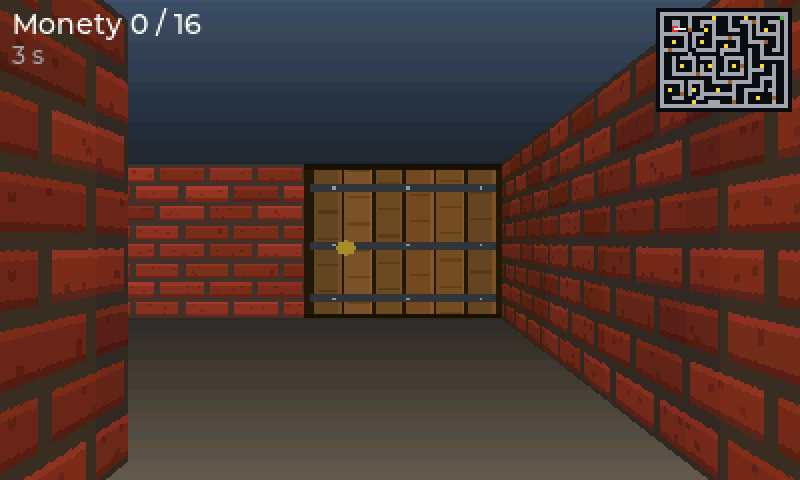 | 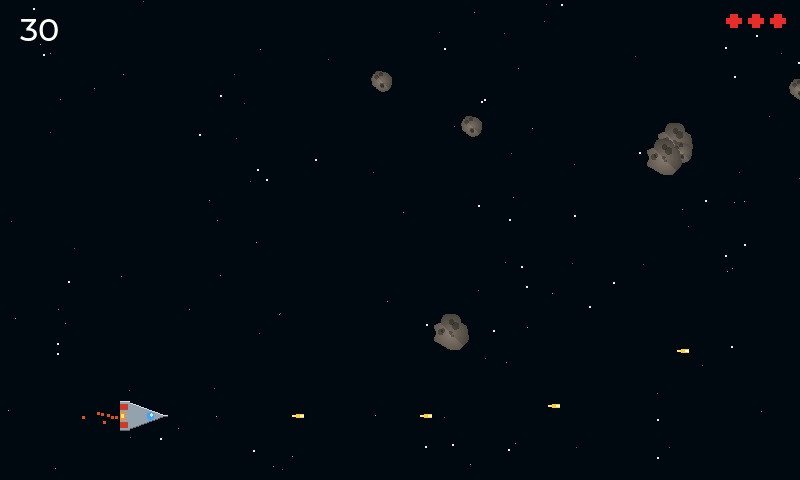 |
|---|---|
| **Labirynt 3D** — pseudo-3D metodą raycastingu (jak Wolfenstein 3D): 400 promieni na klatkę, teksturowane ściany, drzwi otwierające się przy podejściu, monety i portal jako sprite'y skalowane odległością, mini-mapa. Płótno 400x240 x2. | **Kosmos** — strzelanka w natywnym 800x480: statek, asteroidy rozpadające się na mniejsze, gwiazdy w trzech warstwach paralaksy, wybuchy z klatek PNG, iskry silnika. |

## Kart: wyścigi w stylu Mario Kart – prawdziwe 3D

| 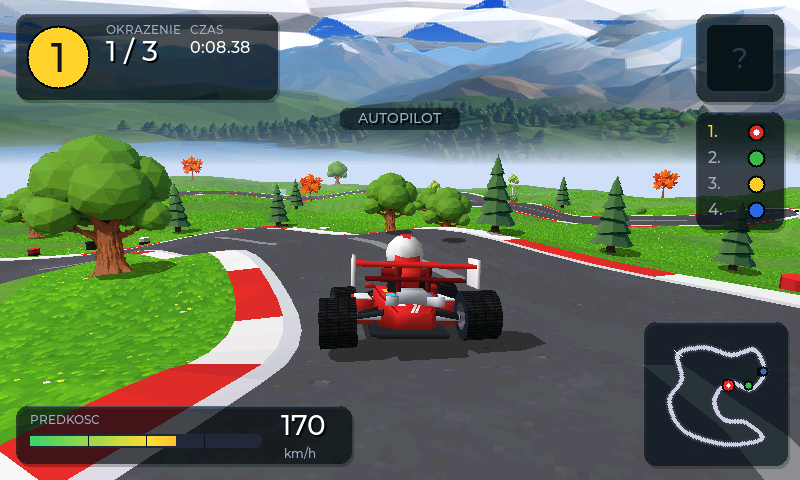 | 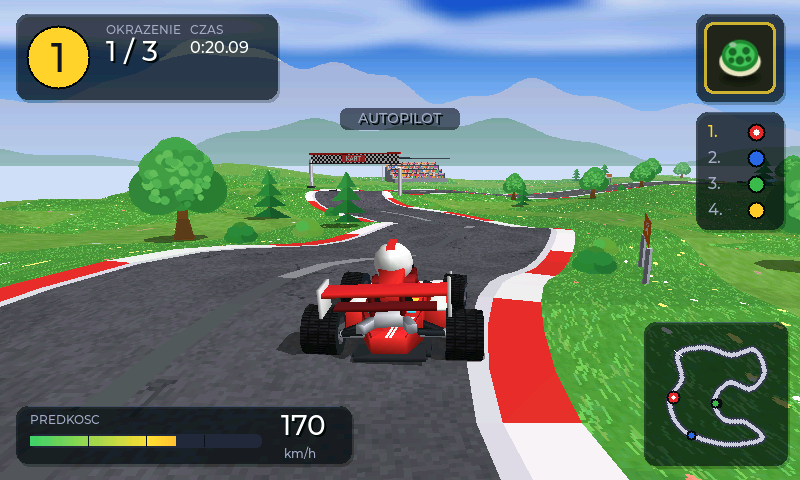 |
|---|---|

Gra działa na własnym **software'owym rendererze 3D** ([src/gfx3d/](src/gfx3d/)): trójkąty low-poly z cieniowaniem
płaskim, gładkim (Gouraud) albo **teksturowanym** (od 25.09: atlas 8-bit z paletą `assets/kart/atlas.png` i colormapa
odcień × mgła jak w silnikach z lat 90., korekcja perspektywy co 16 px), światło kierunkowe z odblaskiem, mgła,
odrzucanie tylnych ścian, przycinanie do płaszczyzny bliskiej, sortowanie malarskie kubełkami po głębokości plus
opcjonalny Z-bufor 16-bit do przecinających się brył, **cienie rzutowane** przez maskę (półprzezroczyste, o kształcie
bolidu). Asfalt z ziarnem, trawa, malowania bolidów z numerami, bieżnik opon, publiczność na trybunie, banery, drzewa
i krzaki jako billboardy pochodzą z atlasu. Tor z 16 punktów kontrolnych ma wzniesienia, krawężniki czerwono-białe,
linie, szachownicę startu i szewrony pól przyspieszenia; przy torze brama startowa, trybuna, stosy opon, banery. Bolidy
to modele 3D z brył ściętych (kadłub, pontony z wlotami, airbox, dwa skrzydła, wahacze i oś, koła z oponą i felgą,
kierowca z kaskiem) z lakierem z odblaskiem i **śladami opon** po drifcie; koła obracają się z prędkością, przednie
skręcają, całość przechyla się w zakrętach i na górkach. Kamera jedzie za gokartem, podąża za terenem i rozszerza kąt
przy turbo. Niebo, chmury, góry, dym driftu, kurz i płomień turbo to obrazy PNG z alfą rzutowane w scenę. W grze: 3 okrążenia,
3 rywali sterowanych przez AI (jadą po linii środkowej z własnym pasem i „gumą” wyrównującą tempo), skrzynki
z przedmiotami (grzyb = turbo, banan = pułapka, skorupa = pocisk), drift z mini-turbo (B podczas skrętu), pola
przyspieszenia, hamulec, wirowanie po trafieniu, kolizje z drzewami, stosami opon i słupami, ranking na żywo, licznik
czasu i najlepszego okrążenia, mini-mapa,
komunikaty o okrążeniach, tabela wyników z czasami na mecie. **Y (trzymaj)** włącza autopilota – demo i podstawa testów regresji.
Sterowanie: A gaz, strzałki skręt, B drift, X przedmiot, dół hamulec.

**Cztery tory** (wybór strzałkami na ekranie tytułowym, rekord okrążenia każdego toru zapisywany w pamięci):
Jezioro (łąka), Kanion (pustynia, mesy), Zimowa przełęcz (śnieg), Jesienny las. Każdy ma własny układ, wzgórza,
tekstury nawierzchni, drzewa, panoramę gór i kolory nieba – dane w `src/games/kart/kart_tracks.h`, grafika z Gemini
(`assets_src/kart/` → `tools/gen_kart_gemini.py` → `tools/gen_kart_atlas.py`). Nowy tor sprawdza
`tools/kart_tracks_check.py`.

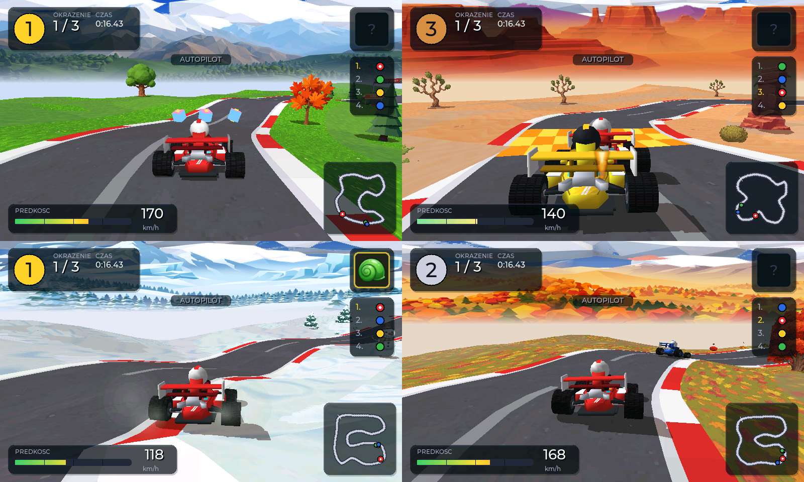

Fizyka pozostaje 2D (płaszczyzna XZ, mapa nawierzchni 128×128), wysokość terenu jest tylko wizualna. Elementy 2D
(ikony, chmury, góry, dym, płomień) generuje `tools/gen_kart_assets.py`, a wersje z Gemini (góry, chmury, ikony,
drzewa: `assets_src/kart/`) nakłada `tools/gen_kart_gemini.py`, atlas tekstur `tools/gen_kart_atlas.py` (oba Pillow;
własny PNG o tym samym układzie kafelków zastępuje atlas bez zmian w kodzie). Gdy render trwa dłużej niż 13 ms (płytka),
gra sama skraca zasięg rysowania, przechodzi na cieniowanie płaskie, wyłącza Z-bufor, potem krzaki i cienie.

Obie gry czytają grafikę z `assets/labirynt3d/` i `assets/kosmos/` (PNG). Pliki wygenerował skrypt
`python tools/gen_demo_assets.py` — wystarczy podmienić PNG o tej samej nazwie, żeby zmienić wygląd.
Pełne 3D z wielokątami nie ma sensu na P4 bez GPU (patrz [docs/DECYZJE.md](docs/DECYZJE.md), wpis 23);
raycasting daje efekt 3D kosztem ok. 0,1 ms na klatkę na PC (szacunkowo 2-4 ms na P4).

## Menu konsoli

|  | 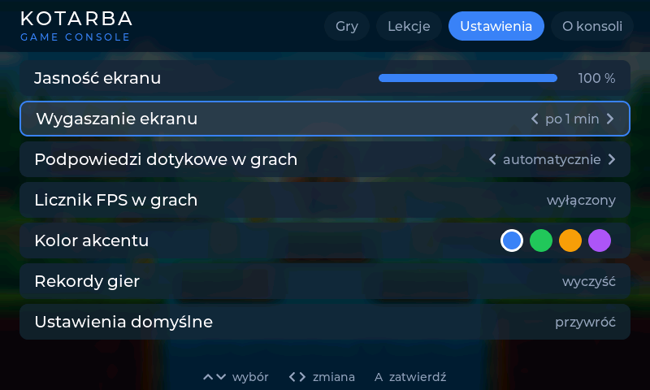 |
|---|---|

Ekran startowy z logo, potem pasek z czterema zakładkami. **Gry:** karuzela okładek (strzałki lub przesunięcie palcem,
A albo stuknięcie w środkową okładkę uruchamia grę), tło to rozmyta okładka wybranej gry. **Lekcje:** lista lekcji i gier
ucznia z podglądem. **Ustawienia:** jasność ekranu, wygaszanie po 1–10 min bezczynności, podpowiedzi dotykowe w grach,
licznik FPS, kolor akcentu, kasowanie rekordów, ustawienia domyślne – zapisywane w pamięci NVS. **O konsoli:** wersja,
pamięć, czas pracy, test przycisków. Zakładki: GÓRA, potem LEWO/PRAWO, albo X/Y. Polskie litery w UI i w grach
(`gfx/text.h`) dają czcionki uzupełniające z `tools/gen_pl_fonts.py`; okładki z Gemini obrabia `tools/gen_covers.py`,
gra bez okładki dostaje zastępczą (kolor z nazwy, inicjał).

## Snake: wąż w pięciu światach

| 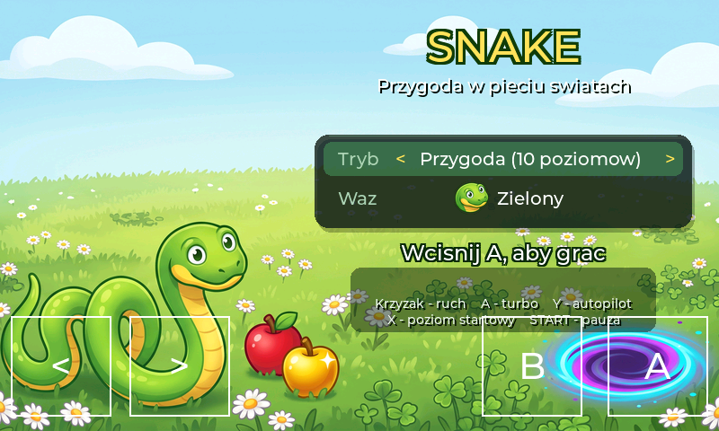 | 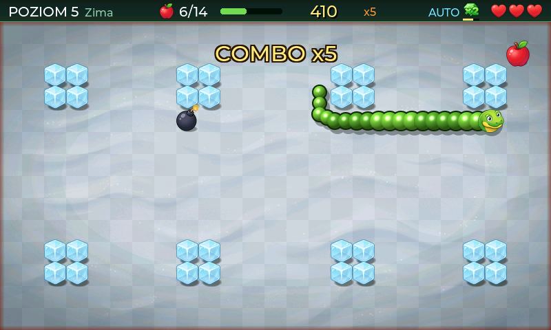 |
|---|---|

Pełna gra w węża w natywnym 800×480, pole 25×14 kratek po 32 px. **Przygoda:** 10 poziomów w 5 światach (łąka, pustynia,
zima, dżungla, wulkan) – na każdym trzeba zjeść N jabłek (8…20), wtedy otwiera się portal do następnego poziomu (premia za
czas, długość i życia). Część poziomów ma ściany na krawędziach, część otwarte krawędzie (zawijanie). **Bez końca:** otwarte
pole, świat zmienia się co 20 jabłek. Wąż przyspiesza z poziomem i z długością (−1 % odstępu kroku na segment, maks. −40 %),
ruch jest po kratkach, ale rysowany płynnie (interpolacja między krokami).

Przedmioty: jabłko (+1 segment), złote jabłko (+3, znika po 6 s), grzyb (skraca o 3), klepsydra (spowolnienie 8 s), gwiazda
(duch 6 s – przez przeszkody, siebie i krawędzie), serce (+życie, maks. 5), magnes (jabłka w promieniu 5 kratek podchodzą),
klejnot ×2 (punkty ×2 przez 12 s), kula-tarcza (jedno darmowe zderzenie), bomba (od poziomu 3; zjedzona = strata życia,
niezjedzona wybucha sama po 12 s). Combo do ×5 za jabłka jedzone w odstępie < 3 s. Rekordy (top 5) w pamięci do wyłączenia
konsoli. Sterowanie: krzyżak (kolejka do 3 skrętów) albo **2 przyciski** (wiersz „Ruch” na ekranie tytułowym: Lewo/Prawo
skręcają węża o 90° względem kierunku jazdy, jak w starych telefonach), A trzymane = turbo, X na ekranie tytułowym = poziom startowy,
Y = autopilot (BFS do najbliższego celu; demo i testy – przechodzi całą kampanię bez straty życia).

Grafika: przedmioty, przeszkody, portal, głowy węża (3 kolory), 5 teł i ilustracja tytułowa wygenerowane w Gemini
(25.09.2026, konto użytkownika), obrobione skryptem `python tools/gen_snake_assets.py` (wycięcie tła magenta z miękką
krawędzią, skala, korekta jasności teł). Ciało węża to cieniowane kulki generowane w kodzie (obrys + kolor + cień przez maskę).

## Pacman: labirynt z czterema duchami

| 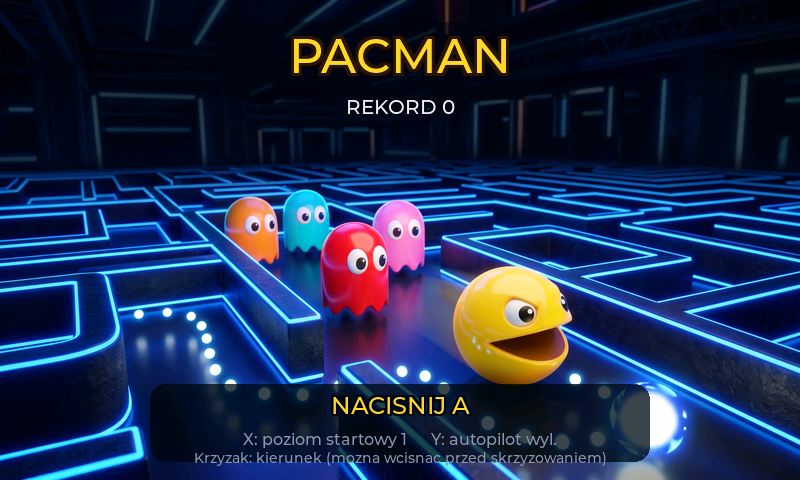 | 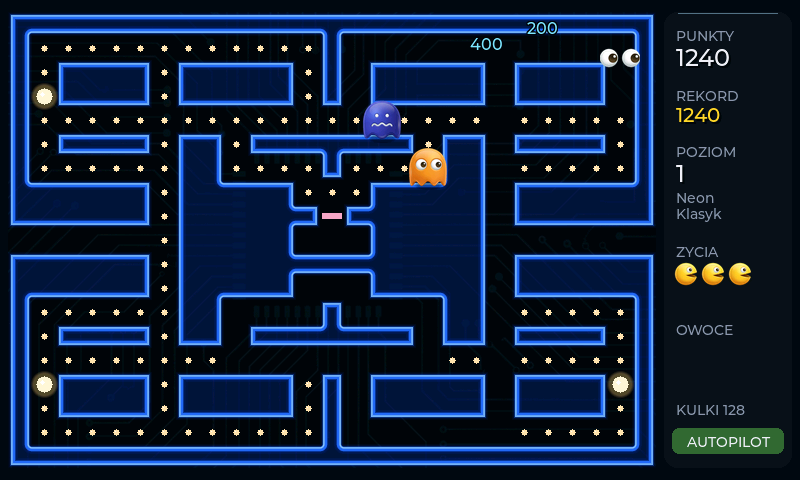 |
|---|---|

Klasyczne zasady w natywnym 800×480: labirynt 27×19 kratek po 24 px po lewej, panel z punktami po prawej. Kulka 10 pkt
(każda zatrzymuje gracza na klatkę, duża na 3 – jak w oryginale), duża kulka 50 pkt i na kilka sekund duchy uciekają –
zjedzone dają 200/400/800/1600 w jednym ciągu i wracają do domu jako same oczy. Owoc pojawia się po 70 i 170 zjedzonych kulkach (wiśnie … gwiazda, 100 … 5000
pkt), dodatkowe życie za 10 000. Cztery duchy z celami jak w oryginale: czerwony goni, różowy zachodzi 4 kratki przed gracza,
błękitny celuje w punkt odbity względem czerwonego, pomarańczowy goni z daleka i ucieka do rogu z bliska; tryby rozproszenia
i pościgu zmieniają się wg zegara oryginału (poziom 1: 7/20/7/20/5/20/5 s, poziomy 2–4 i 5+ z coraz krótszym rozproszeniem),
a każda zmiana odwraca duchy. **Tabele poziomów z automatu** (Pac-Man Dossier): prędkość gracza 80 → 90 → 100 % (90 % od
poziomu 21), duchów 75 → 85 → 95 %, w tunelu 40–50 %, czas strachu 6, 5, 4, 3, 2, 5, 2, 2, 1, 5, 2, 1, 1, 3, 1, 1, 0 … s
z liczbą mignięć, progi „Cruise Elroy” (czerwony przyspiesza przy 20/10 kulkach na poziomie 1, aż do 120/60), wyjścia
z domu wg liczników kulek (osobiste 0/30/60 na poziomie 1, 0/0/50 na 2; globalne 7/17/32 po stracie życia; 4 s bez
jedzenia = wyjście, 3 s od poziomu 5) i strefy nad domem i nad startem, gdzie duchy nie skręcają w górę. Osiem plansz
(„Klasyk” ręcznie, siedem z generatora `tools/pacman_maze_gen.py` z gwarancją braku ślepych zaułków, tunele w różnych
wierszach) i osiem światów (neon, cukierki, dżungla, lawa, ocean, kosmos, pustynia, lód – tło z Gemini, kolor ścian);
poziom n gra na planszy (n−1) mod 8, tunel zawija. Sterowanie: krzyżak – kierunek można
wcisnąć wcześniej, skręt następuje na najbliższym skrzyżowaniu (także 6 px przed środkiem kratki, jak w oryginale),
zawrócenie natychmiast; X na tytule = poziom startowy (1–12), Y = autopilot (BFS z omijaniem duchów, goni przestraszone;
demo i testy). Rekord w NVS (`pacman_top`).

Grafika: bohater (4 klatki paszczy + 4 klatki śmierci), duchy (4 kolory × 2 klatki, przestraszony niebieski/biały, oczy),
8 owoców, ilustracja tytułowa i 8 teł z Gemini (25.09.2026, konto użytkownika), obróbka `python tools/gen_pacman_assets.py`
(klatki paszczy wyrównane do lewej krawędzi, żeby kula nie skakała między klatkami; różowy duch kluczowany wyższym progiem
magenty). Ściany rysowane w kodzie z pola odległości od korytarza: neonowa rurka w stałej odległości od korytarza
(narożniki zaokrąglone same z siebie), poświata, ciemna płyta w głębi bloków, ramka zewnętrzna z podwójną linią –
wypalane raz na poziom razem z tłem. Na PC 0,30 ms/klatkę.

## Space Invaders: kosmiczni najeźdźcy w nowoczesnej oprawie

| 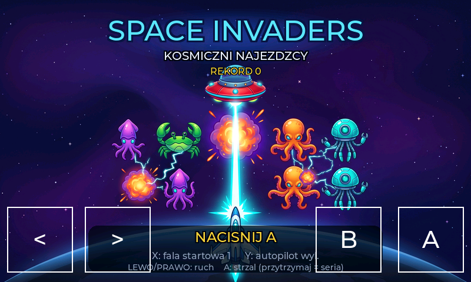 | 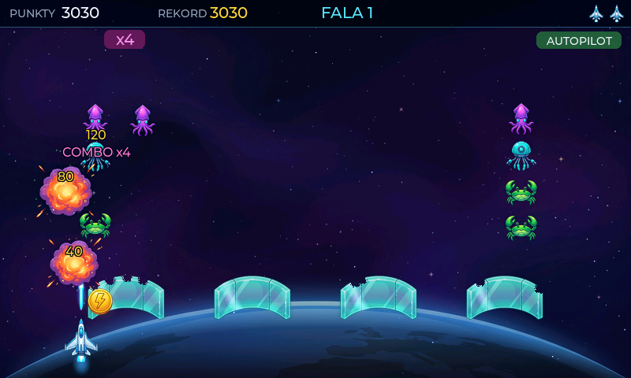 |
|---|---|
| 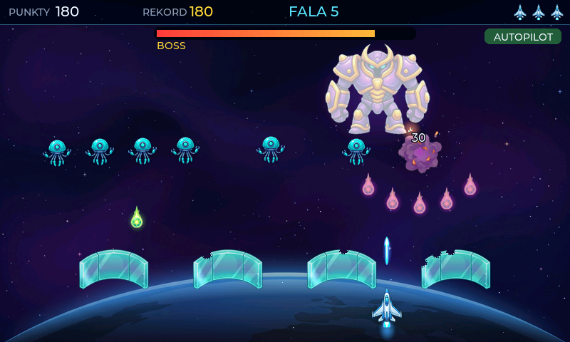 | |

Formacja 5×10 obcych (kalmar 40 pkt, meduza 30, krab 20, ośmiornica 10) przesuwa się na boki i schodzi w dół na każdej
krawędzi, przyspiesza, gdy jej ubywa – dojście do linii bunkrów kończy grę. Od fali 2 pojedynczy obcy nurkują łukiem na
gracza i wracają na swoje miejsce (zestrzelony w locie – punkty ×2), od fali 3 część pocisków celuje w statek. UFO
przelatuje górą i zostawia bonus: potrójny strzał, laser (szybki ogień, pociski przebijają), osłona (pochłania jedno
trafienie), spowolnienie czasu albo dodatkowe życie. Cztery kryształowe bunkry kruszą się piksel po pikselu z obu stron.
Co 5. fala to boss z paskiem życia, wachlarzami pocisków i eskortą. Combo: trafienia w odstępach < 0,7 s mnożą punkty
do ×4. Cztery światy (orbita, pierścienie, pas asteroid, czarna dziura) na zmianę co falę. Sterowanie: lewo/prawo albo
gałka, A = strzał (przytrzymanie = seria), X na tytule = fala startowa, Y = autopilot (demo i testy). Rekord w NVS
(`invaders_top`).

Grafika: 2 arkusze sprite'ów (obcy × 2 klatki, UFO, boss zwykły i uszkodzony, statek, bunkier, pociski, bonusy, 4 klatki
wybuchu), 4 tła i ilustracja tytułowa z Gemini (25.09.2026, konto użytkownika), obróbka `python tools/gen_invaders_assets.py`.
W kodzie: gwiazdy paralaksy w 3 warstwach, poświaty addytywne (pociski, silnik, UFO, boss), iskry, pierścień osłony,
wstrząsy ekranu. Na PC 0,48 ms/klatkę.

## Dodawanie nowej gry

**Prosta gra (jak lekcja):** skopiuj `src/games/lekcje/00_szablon`, zmień `CONSOLE_ADD_GAME(id, "Nazwa", "opis")` na końcu
`gra.cpp`, dopisz `LEKCJA(id)` w [src/games/lekcje/lista.h](src/games/lekcje/lista.h). Emulator wykryje nowy plik sam.

**Gra na pełnym silniku (jak Lake Mario):**

1. Nowy katalog `src/games/<nazwa>/`, klasa dziedzicząca po `engine::Game` (`init`, `update`, `render`, `debug_line`).
2. Rysowanie na `gfx::Canvas` 800x480 (albo 400x240 powiększane x2 przez konsolę, gdy `canvas_scale()` zwraca 2 — pixel-art jak Lake Mario), wejście z `input::PadState`, losowość z `engine::rng()`, wygładzony tekst z `gfx/text.h`.
3. Wpis `{ "id", "Nazwa", "opis", fabryka }` w [src/games/registry.cpp](src/games/registry.cpp) — gra pojawi się w menu
   i pod `console_sim.exe --game id`.
4. Firmware wylicza listę plików przy konfiguracji: po dodaniu plików `pio run --target clean`.

## UI w grze

Gry rysują HUD własnym rendererem, bo działa co klatkę i jest tani. Gdy potrzebne jest bogatsze UI
(menu, lista, klawiatura), użyj LVGL tak jak robi to ekran pauzy: zamroź klatkę gry do bufora,
podaj ją przez `ui::set_background_frame()` i zbuduj widgety na wierzchu. LVGL potrzebuje
nieprzezroczystego tła — rysowanie widgetów wprost na pikselach gry nie zadziała.

## Plan (roadmapa)

- [x] Platforma do nauki C++: API `console`, 13 lekcji z testami, skrypt instalacyjny na komputer ucznia (`docs/NAUKA.md`)
- [ ] Próba generalna `tools/setup_kid_pc.ps1` na czystej maszynie, gałąź `lekcje`
- [ ] Uruchomienie na sprzęcie: ekran, dotyk, orientacja (patrz `docs/HARDWARE.md`)
- [ ] Dźwięk: ES8311 przez I2S (efekty + muzyka)
- [ ] Assety z partycji SPIFFS (narzędzie PNG -> RGB565)
- [ ] Ekran ustawień i zapis wyników w NVS
- [ ] Gamepad BLE przez ESP32-C6 (drugi gracz)

## Znane pułapki toolchaina (Windows + PlatformIO)

- **LVGL na ESP-IDF domyślnie ignoruje `lv_conf.h`** (`CONFIG_LV_CONF_SKIP=y`). Dlatego
  `sdkconfig.defaults` ustawia `CONFIG_LV_CONF_SKIP=n`, a `CMakeLists.txt` dokłada `src/ui`
  do ścieżki include wszystkich komponentów. Flagi z `platformio.ini` tam nie docierają.
- Plik `lv_conf.h` musi definiować strażnik o nazwie `LV_CONF_H` — po niej LVGL poznaje, że
  konfiguracja została wczytana.
- LVGL domyślnie dokłada do kompilacji swoje przykłady i dema (~258 plików). Wyłącza się je
  w `sdkconfig.defaults`, bo to opcje Kconfiga, nie `lv_conf.h`.
- Świeże `git init` **bez commita** wywala build: ESP-IDF woła `git describe` i nie znajduje HEAD.
- `espressif/esp_hosted` >= 3.0 nie kompiluje się pod PlatformIO na Windows — przy dodawaniu Wi-Fi
  przypnij `>=2.11,<3.0`.
- MinGW z MSYS2 wymaga `C:\msys64\mingw64\bin` w PATH, inaczej CMake zgłasza, że kompilator
  "nie jest w stanie skompilować prostego programu".
