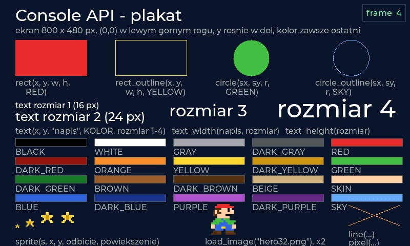

# Console API – opis funkcji dla ucznia

Wszystko, czego używasz w `gra.cpp`. Jedna linia na początku pliku daje ci to wszystko:

```cpp
#include "console/console.h"
```

Gra to dwie funkcje, które piszesz sam:

| funkcja | kiedy się wykonuje | do czego |
|---|---|---|
| `void setup()` | raz, na starcie gry (i po `restart()`) | wartości startowe zmiennych, `load_sprite`, `load_map` |
| `void frame()` | 60 razy na sekundę | ruch, sprawdzanie klawiszy, rysowanie całej klatki od nowa |

Na końcu pliku rejestrujesz grę: `CONSOLE_ADD_GAME(id, "Nazwa w menu", "Opis")` i dopisujesz `LEKCJA(id)` w `src/games/lekcje/lista.h`.



*Ten obrazek to gra „Plakat API" (ostatnia w menu, `src/games/lekcje/99_api_demo/gra.cpp`) – każdy podpis to dokładnie wywołanie, które narysowało figurę nad nim.*

## Ekran i współrzędne

Ekran ma **800 × 480** pikseli. Punkt `(0, 0)` to lewy górny róg, `x` rośnie w prawo, `y` rośnie **w dół**.
Środek ekranu to `(400, 240)`.

| funkcja | co zwraca / robi |
|---|---|
| `screen_width()` | 800 |
| `screen_height()` | 480 |
| `clear(KOLOR)` | zamalowuje cały ekran jednym kolorem; zwykle pierwsza linia `frame()` |

Ekran **nie czyści się sam** – co klatkę rysujesz wszystko od nowa. Jeśli zapomnisz `clear`, poruszające się rzeczy zostawią smugi (czasem to fajny efekt).

## Kolory

Typ koloru to `Color`. Gotowe kolory (wielkimi literami):

```
BLACK  WHITE  GRAY  DARK_GRAY
RED    DARK_RED    ORANGE    YELLOW    DARK_YELLOW
GREEN  DARK_GREEN  BROWN     DARK_BROWN  BEIGE  SKIN
BLUE   DARK_BLUE   PURPLE    DARK_PURPLE  SKY
```

Własny kolor: `rgb(czerwony, zielony, niebieski)`, każda liczba 0–255.

```cpp
Color moj = rgb(255, 128, 0);      // pomaranczowy
Color tlo = rgb(15, 23, 42);       // bardzo ciemny granat
rect(10, 10, 50, 50, moj);
```

Kolor to osobny typ, więc pomyłka w kolejności argumentów (`rect(10, 10, RED, 50, 50)`) jest błędem kompilacji, a nie dziwnym obrazkiem.

## Figury

Wszystkie współrzędne i rozmiary w pikselach (liczby całkowite). Kolor jest zawsze **ostatni**.

| funkcja | rysuje |
|---|---|
| `pixel(x, y, KOLOR)` | jeden punkt |
| `rect(x, y, szerokosc, wysokosc, KOLOR)` | wypełniony prostokąt; `(x, y)` to lewy górny róg |
| `rect_outline(x, y, szerokosc, wysokosc, KOLOR)` | sam obrys prostokąta, 1 px |
| `circle(srodek_x, srodek_y, promien, KOLOR)` | wypełnione koło |
| `circle_outline(srodek_x, srodek_y, promien, KOLOR)` | sam okrąg, 1 px |
| `line(x1, y1, x2, y2, KOLOR)` | odcinek od punktu 1 do punktu 2 |

```cpp
rect(100, 200, 40, 40, RED);            // kwadrat 40x40 z rogiem w (100, 200)
circle(400, 240, 30, GREEN);            // kolo na srodku ekranu
line(0, 479, 799, 479, WHITE);          // linia wzdluz dolnej krawedzi
rect_outline(0, 0, 800, 480, GRAY);     // ramka wokol calego ekranu
```

Uwaga na koło: `(srodek_x, srodek_y)` to **środek**, więc odbicie od prawej krawędzi sprawdzasz jako `x > screen_width() - promien`.

## Tekst

| funkcja | co robi |
|---|---|
| `text(x, y, "napis", KOLOR, rozmiar)` | pisze napis; `(x, y)` to lewy górny róg napisu |
| `text(x, y, liczba, KOLOR, rozmiar)` | pisze liczbę (np. wynik) |
| `text_width("napis", rozmiar)` | szerokość napisu w pikselach |
| `text_height(rozmiar)` | wysokość jednej linii |

`rozmiar` to 1, 2, 3 albo 4:

| rozmiar | wysokość czcionki | do czego |
|---|---|---|
| 1 | 16 px | podpisy, panel `watch` |
| 2 | 24 px | zwykły tekst, „Wcisnij A" |
| 3 | 32 px | wynik gry |
| 4 | 48 px | tytuł, „GAME OVER" |

Napis wyśrodkowany w poziomie:

```cpp
const char* napis = "GAME OVER";
text((screen_width() - text_width(napis, 4)) / 2, 200, napis, RED, 4);
```

Czcionka ma litery, cyfry i znaki, ale **nie ma polskich liter** (ą, ę, ł…) – rysują się jako `?`. Pisz `Wcisnij`, nie `Wciśnij`.

## Obrazki (sprite'y)

Obrazek rysujesz **literami**: każda linia to rząd pikseli, każda litera to kolor z palety, kropka to przezroczystość.

```cpp
const char* const MONETA[8] = {     // 8 linii = 8 pikseli wysokosci
    "..yyyy..",                     // 8 znakow = 8 pikseli szerokosci
    ".yYYYYy.",
    "yYyyyyYy",
    "yYyyyyYy",
    "yYyyyyYy",
    "yYyyyyYy",
    ".yYYYYy.",
    "..yyyy..",
};

Sprite moneta;                      // zmienna na gotowy obrazek

void setup()
{
    moneta = load_sprite(MONETA);   // litery -> piksele; RAZ, w setup()
}

void frame()
{
    sprite(moneta, 100, 200, false, 3);   // rysuj w (100, 200), bez odbicia, powiekszony 3x (24x24 px)
}
```

| litera | kolor | litera | kolor |
|---|---|---|---|
| `k` | czerń | `w` | biel |
| `e` | szary | `E` | ciemny szary |
| `r` | czerwień | `R` | ciemna czerwień |
| `o` | pomarańcz | `y` / `Y` | żółty / ciemny żółty |
| `g` / `G` | zieleń / ciemna zieleń | `b` / `B` | brąz / ciemny brąz |
| `t` | beż | `s` | skóra |
| `u` / `U` | niebieski / ciemny niebieski | `p` / `P` | fiolet / ciemny fiolet |
| `.` lub spacja | przezroczysty | | |

| funkcja | co robi |
|---|---|
| `Sprite s = load_sprite(RYSUNEK)` | zamienia tablicę napisów na obrazek; szerokość = najdłuższa linia |
| `sprite(s, x, y, odbicie, powiekszenie)` | rysuje; `odbicie` = `true` odbija w lustrze (postać patrzy w lewo); `powiekszenie` 1–4 |
| `s.w`, `s.h` | szerokość i wysokość obrazka w pikselach (przed powiększeniem) |

Na ekranie 800×480 obrazek 16×16 jest malutki – rysuj go z powiększeniem 2 albo 3. Rozmiar na ekranie to `s.w * powiekszenie`.
`load_sprite` wołaj w `setup()`, nie w `frame()` (pamięć na obrazki jest ograniczona: 256 kB, czyli np. 16 obrazków 64×64).

### Obrazki z plików PNG

Zamiast literek możesz narysować grafikę w dowolnym programie (Paint, Piskel, Aseprite, GIMP) i zapisać jako **PNG**.
Plik wrzucasz do katalogu `assets/<id gry>/`, gdzie `<id gry>` to pierwsze słowo z `CONSOLE_ADD_GAME(...)` na końcu `gra.cpp`.
Przykład: gra `bohater` ma pliki w `assets/bohater/`.

```cpp
Sprite hero;

void setup()
{
    hero = load_image("hero.png");        // czyta assets/bohater/hero.png
}

void frame()
{
    sprite(hero, 100, 200, false, 2);      // rysuje jak kazdy inny obrazek, tu powiekszony 2x
}
```

| funkcja | co robi |
|---|---|
| `Sprite s = load_image("plik.png")` | wczytuje PNG z katalogu gry (w `setup()`); brak pliku = pusty obrazek i komunikat w terminalu |
| `load_image("wspolne/moneta.png")` | nazwa ze znakiem `/` liczy się od katalogu `assets/` – tak dzielisz obrazki między grami |

Zasady dla pliku PNG:

- **Przezroczystość** działa: przezroczyste piksele PNG (kanał alfa) nie są rysowane. Ale bez półprzezroczystości –
  piksel jest albo widoczny, albo nie (próg 50 %). Rysuj z twardymi krawędziami, bez „wygładzania" wokół postaci.
- Rozmiar: rozsądnie do 128×128 px; obrazek 64×64 zajmuje 8 kB pamięci konsoli. Kolory są zamieniane na 65 tysięcy
  odcieni (RGB565) – delikatne gradienty mogą się lekko „schodkować".
- Nazwy plików: małe litery, bez spacji i polskich znaków, np. `hero.png`, `moneta_zlota.png`.
- Na komputerze emulator czyta pliki prosto z katalogu `assets/`. Na prawdziwej konsoli trzeba je wgrać na płytkę
  poleceniem `pio run -t uploadfs` (robi to rodzic, raz po każdej zmianie obrazków).

Obrazek z liter (`load_sprite`) i z pliku (`load_image`) to ten sam typ `Sprite` – rysujesz je tak samo, możesz mieszać.

## Klawisze

Konsola ma krzyżak i cztery przyciski. W emulatorze: strzałki, **Z** = A, **X** = B, **S** = X, **A** = Y.

| funkcja | prawda gdy… |
|---|---|
| `held(KLAWISZ)` | klawisz jest **trzymany** w tej klatce – do chodzenia |
| `pressed(KLAWISZ)` | klawisz został **właśnie wciśnięty** (raz na naciśnięcie) – do skoku, strzału |
| `released(KLAWISZ)` | klawisz został właśnie puszczony |

Klawisze: `UP`, `DOWN`, `LEFT`, `RIGHT`, `A`, `B`, `X`, `Y`. START należy do konsoli (pauza) – gra go nie widzi.

```cpp
if (held(LEFT))  x = x - 4;
if (held(RIGHT)) x = x + 4;
if (pressed(A) && on_ground) vy = -13;     // skok tylko raz na nacisniecie i tylko z ziemi
```

## Czas i losowość

| funkcja | co zwraca |
|---|---|
| `frame_count()` | numer klatki od `setup()`: 0, 1, 2, … (60 na sekundę) |
| `seconds()` | sekundy od `setup()` (ułamek, np. 2.35) |
| `dt()` | czas jednej klatki w sekundach (~0.0167) – przydatne dopiero w zaawansowanych grach |
| `random(a, b)` | losowa liczba całkowita od `a` do `b`, **oba włącznie** |
| `chance(procent)` | `true` z podanym prawdopodobieństwem, np. `chance(30)` w 30 % klatek |
| `random_seed(liczba)` | ustawia „ziarno" losowania: to samo ziarno = ten sam ciąg liczb |

Co N klatek: `if (frame_count() % 30 == 0) { ... }`. Animacja dwuklatkowa: `int poza = (frame_count() / 10) % 2;`.

W trybie testowym emulatora (`--frames`) ziarno jest stałe, więc `random` daje zawsze ten sam ciąg – dzięki temu testy zadań są powtarzalne.

## Kolizje i matematyka

| funkcja | co robi |
|---|---|
| `overlaps(x1, y1, w1, h1, x2, y2, w2, h2)` | `true`, gdy dwa prostokąty na siebie nachodzą |
| `overlaps(Rect a, Rect b)` | to samo dla struktur `Rect {x, y, w, h}` |
| `clamp(v, min, max)` | przycina liczbę do zakresu: za małą podnosi do `min`, za dużą obcina do `max` |
| `abs(v)` | wartość bezwzględna |
| `min(a, b)`, `max(a, b)` | mniejsza / większa z dwóch |

```cpp
paddle_x = clamp(paddle_x, 0, screen_width() - PADDLE_W);     // paletka nie wyjedzie za ekran
if (overlaps(ball_x - R, ball_y - R, 2 * R, 2 * R, paddle_x, PADDLE_Y, PADDLE_W, PADDLE_H)) { ... }
```

Koło do `overlaps` podajesz jako kwadrat: lewy górny róg `(srodek - promien)`, bok `2 * promien`.

## Mapa kafelków (lekcja 12)

Poziom platformówki rysujesz literami jak sprite, tylko każdy znak to kafelek **32 × 32 px**: 15 linii = 480 px = cały ekran w pionie, 25 znaków = ekran w poziomie (mapa może być szersza – wtedy potrzebna kamera).

```cpp
const char* const MAPA[15] = {
    "                         ",
    "         o     BBB       ",
    "#########################",
    "=========================",
};

void setup()
{
    load_map(MAPA, "#=B");     // drugi argument: znaki, ktore sa STALE (sciany, podloga)
}
```

| funkcja | co robi |
|---|---|
| `load_map(MAPA, "znaki stale")` | wczytuje poziom (w `setup()`) |
| `TILE` | rozmiar kafelka: 32 |
| `map_cols()`, `map_rows()` | rozmiar mapy w kafelkach |
| `map_width()` | szerokość mapy w pikselach (`map_cols() * TILE`) |
| `map_tile(kolumna, wiersz)` | znak kafelka; spacja poza mapą |
| `map_set(kolumna, wiersz, znak)` | zmienia kafelek, np. zebrana moneta: `map_set(c, r, ' ')` |
| `map_solid(kolumna, wiersz)` | czy kafelek jest stały |
| `map_solid_at(px, py)` | to samo dla punktu w pikselach |
| `map_col(px)`, `map_row(py)` | numer kolumny / wiersza dla piksela |
| `draw_tiles(znak, KOLOR, cam_x)` | rysuje każdy kafelek o tym znaku jako prostokąt |
| `draw_tiles(znak, sprite, cam_x)` | to samo obrazkiem (16×16 powiększa się do kafelka) |

`cam_x` to przesunięcie kamery w pikselach: `cam_x = clamp(gracz_x - 320, 0, map_width() - screen_width());`. Wszystko, co rysujesz sam, rysuj w `x - cam_x`.

### Ruch z kolizjami: `move_box`

```cpp
MoveResult r = move_box(p.x, p.y, PLAYER_W, PLAYER_H, p.vx, p.vy);
if (r.on_ground && pressed(A)) p.vy = -13;
```

`move_box` przesuwa prostokąt `(x, y, w, h)` o `(vx, vy)` pikseli i **zmienia twoje zmienne** (dlatego w deklaracji ma `int&`):
zatrzymuje na ścianie (`vx` staje się 0), stawia na podłodze (`vy` = 0), nie przepuszcza przez sufit. Zwraca strukturę:

| pole | znaczenie |
|---|---|
| `r.on_ground` | stoi na stałym kafelku (można skakać) |
| `r.hit_wall` | uderzył w ścianę z boku (przeciwnik: zawróć) |
| `r.hit_head` | uderzył głową w kafelek |
| `r.head_col`, `r.head_row` | który kafelek dostał głową (np. blok do rozbicia) |

## Sterowanie grą i podglądanie

| funkcja | co robi |
|---|---|
| `restart()` | od następnej klatki gra zaczyna od `setup()` – po „GAME OVER" |
| `watch("nazwa", wartosc)` | pokazuje wartość w prawym górnym rogu ekranu (do 8 naraz) i w śladzie emulatora `--trace`; działa dla `int`, `float`, `bool` i napisów |
| `print("tekst")`, `print("tekst", liczba)` | pisze do terminala emulatora; w `frame()` to 60 linii na sekundę – lepiej w `if` |

```cpp
watch("x", ball_x);
watch("dead", dead);
if (frame_count() % 60 == 0) print("sekunda", frame_count() / 60);
```

Wartości z `watch()` czytają testy zadań (`testy.txt`), dlatego w zadaniach pojawia się „dodaj `watch("score", score)`".

## Rzeczy, które zaskakują

- **Zmienne globalne nie zerują się** przy ponownym wejściu do gry z menu – wartości startowe nadawaj w `setup()`, nie przy deklaracji.
- **Liczby całkowite**: `7 / 2` to 3, nie 3.5. Do ułamków użyj `float`, ale w większości gier wystarczą `int` i sztuczki typu „co 3 klatki".
- **Kolejność w `frame()`**: najpierw wejście, potem ruch i kolizje, na końcu rysowanie. Rysowanie przed ruchem daje obraz o klatkę spóźniony.
- **`namespace {` i `}`** na początku i końcu pliku muszą zostać – bez nich dwie lekcje pokłócą się o nazwy `setup` i `frame`.
- **Nazwy zmiennych**: nie używaj `time`, `random`, `abs`, `min`, `max` jako nazw własnych zmiennych – to funkcje.

## Gdzie szukać więcej

- Pełna lista deklaracji z komentarzami: [src/console/console_api.h](../src/console/console_api.h).
- Lekcje wprowadzają te funkcje po kolei: [src/games/lekcje/](../src/games/lekcje/), przegląd w [NAUKA.md](NAUKA.md).
- Instrukcja obsługi emulatora, klawisze, czytanie błędów: [DLA_UCZNIA.md](DLA_UCZNIA.md).
